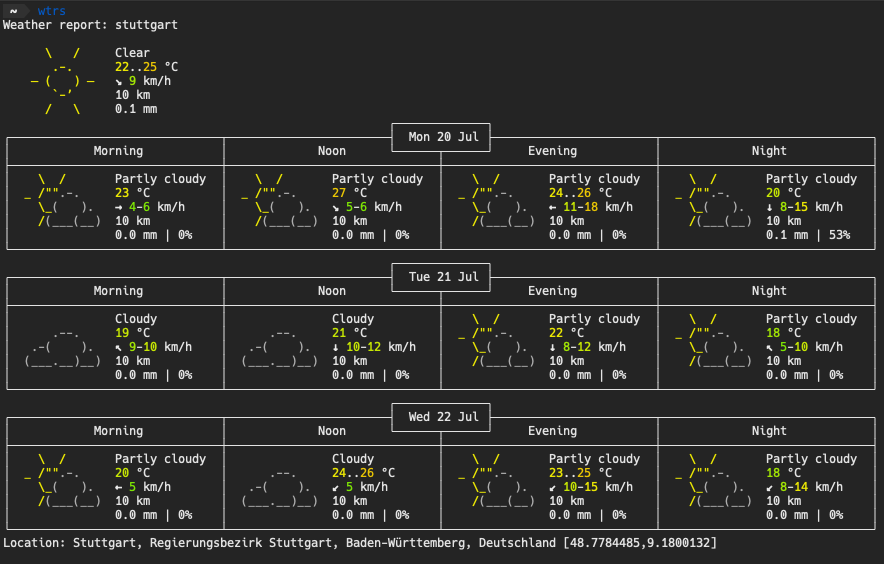

# Getting Weather information in a terminal

 Weather Forecast in your Terminal

Easy and quick way to get the weather forecast in your terminal with a simple curl.

### Outcome



Just type in a terminal:

```bash
$ curl wttr.in
```

If you want to be more specific than your IP will be with your location you can query it with a town name e.g. Stuttgart where I come from:

```bash
$ curl wttr.in/stuttgart
```

I created an alias for all my favorite locations to do so just type:

```bash
$ alias wtrs="curl wttr.in/stuttgart"
```

In [this gitHub repo](https://github.com/chubin/wttr.in) you can read through the whole API.

I think it's fun. Thank you for reading.

